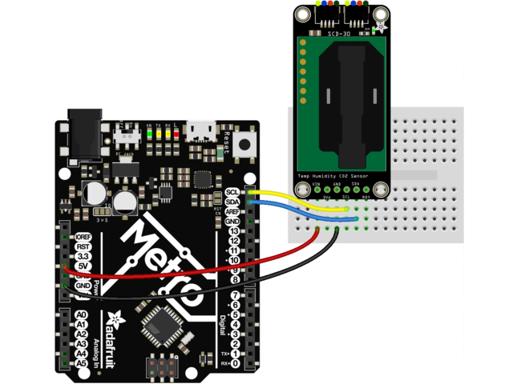
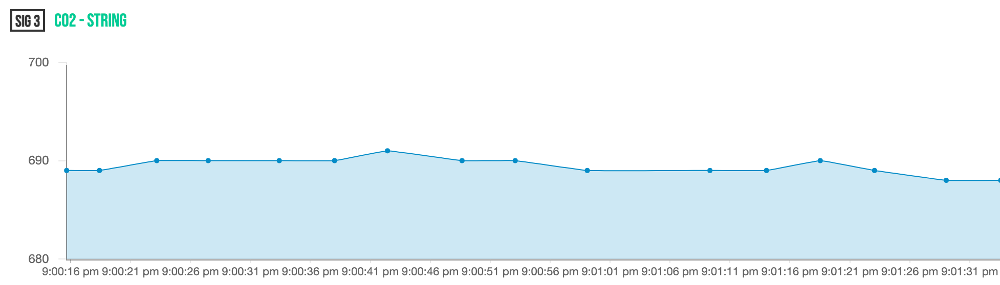
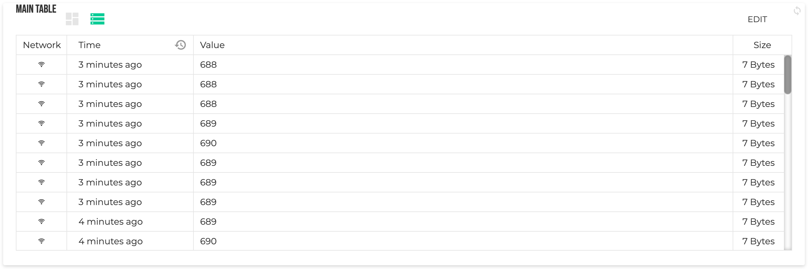

# Room environmental sensor

This project aims to track environmental sensor readings from a room over time. This includes temperature, relative humidity and CO2 levels. Since this will placed indoors it will use WiFi as primary network, and send data over time to a central location.
If I have time I will also add a sound level tracker.

- [Room environmental sensor](#room-environmental-sensor)
    - [Objectives](#objectives)
    - [Material](#material)
    - [Environment setup](#environment-setup)
    - [Putting everything together](#putting-everything-together)
    - [Platforms and infrastructure](#platforms-and-infrastructure)
    - [The code](#the-code)
    - [The physical network layer](#the-physical-network-layer)
    - [Visualisation and user interface](#visualisation-and-user-interface)
    - [Finalizing the design](#finalizing-the-design)

### Objectives

I work in Educational Technology and wanted to dig into IOT and it's applicancy. The impact the working environment has on everyone, including students, is well known. Having IOT units inside the classrooms would allow to track the impact it has, and how the rooms are actually fitted for the numebr of students across all days. This can then be overlayed with other information, like performance, grades, schedules etc. to get an even bigger impact of the data.

Since this all about learning quickly I gave chosen tools that gets me to the end goal quickly, and perhaps not the best choices for a production grade product.

### Material

| Unit | Description | Price|
|------|-------------|------|
| [LoPy4 Bundle](https://www.electrokit.com/produkt/lnu-1dt305-tillampad-iot-lopy4-and-sensors-bundle/) | A bundle created to the previous course by Electrokit, includes the LoPy4 | 949 SEK |
| [SCD-30](https://www.electrokit.com/produkt/miljosensor-scd-30-co2-temperatur-rh/) | Environmental sensor, with "true" CO2 measurements | 799 SEK |
| [Adafruit CCS811](https://www.electrokit.com/produkt/adafruit-ccs811-air-quality-sensor-breakout-voc-and-eco2/) | Environmental sensor for air quality | 279 SEK |
| | **Total price** | 2027 SEK |

I wanted to see the difference between a more expensive environmental sensor and a cheaper one. I have opted for the [SCD-30](https://www.electrokit.com/produkt/miljosensor-scd-30-co2-temperatur-rh/) priced at 799 SEK and the cheaper [Adafruit CCS811](https://www.electrokit.com/produkt/adafruit-ccs811-air-quality-sensor-breakout-voc-and-eco2/) priced at 279 SEK. Both track CO2, but do it very differently.

CCS-811 measures [Volatile Organic Compounds](https://www.epa.gov/indoor-air-quality-iaq/what-are-volatile-organic-compounds-vocs) in the air and tries to deduce the equivelent carbon dioxide (eCO2) based on the total VOC in the air. This is based on the asumption that if the main producer of VOC in a room are people, there is a proportional amount of CO2 [^1]. In other words, it's far from exact, but if used in a room mainly housed of people it will give rough estimate of the CO2.

On the contrary, the SCD-30 uses a [Nondispersive Infrared sensor (NDIR)](https://en.wikipedia.org/wiki/Nondispersive_infrared_sensor) which is a spectroscopic sensor that actually analysis the gas molecules in the air, and outputs the CO2 composition in the air by parts-per-million. This is not an estimate based on other factors, but the real deal. But it is also 2.5 times the price, is it worth it?

Both sensors uses [I2C](https://learn.sparkfun.com/tutorials/i2c/all) to communicate, making it easy to hook both up and read the measurements from both.


### Environment setup

First up is getting the machine working, and to do so I followed the [Getting Started guide from Pycom](https://docs.pycom.io/gettingstarted/). I am running on a Macbook Pro 2019 running macOS 11.4 (Big Sur). I already had NodeJS installed in my machine which is a pre-requistes and decided to use VSCode as it's my preferred choice of IDE. That did however prove to not be completely straight forward. Following the guide I installed the [Pymakr plugin](https://marketplace.visualstudio.com/items?itemName=pycom.Pymakr) and seeing as I already had NodeJS installed I thought I would be golden. But after installing the plugin nothing happens, and all commands fails with the error:

> command 'pymakr.connect' not found

After some fiddling around it turns out you need one more thing on Mac, xcode. So I installed XCode on my machine and presto, all working as intended.

I also set up an account with [Pybytes](https://pybytes.pycom.io/) as I will use that as my main platform to configure and collect data from the sensor.

### Putting everything together
I placed the LoPy4 in the Pycom Expansion board that was both part of the Bundle from Elektrokit. Since both sensors are communicating over I2C I can reuse the same connection for both sensors and communicate with both over the same wires.

I started by connecting the SCD-3 sensor based on the following image (from [adafruits getting started guide](https://learn.adafruit.com/adafruit-scd30?view=all)):

 - Connect board VIN (red wire) to Arduino 5V if you are running a 5V board Arduino (Uno, etc.). If your board is 3V, connect to that instead.
 - Connect board GND (black wire) to Arduino GND
 - Connect board SCL (yellow wire) to Arduino SCL
 - Connect board SDA (blue wire) to Arduino SDA

With this hooked up I needed to setup the I2C connection and start reading the measurements. Since I2C allows you to have multiple peripherals connected using the same wires, you need to adress the specific sensor you want to communicate with. According to the documentation[^3] for the sensor, the adress should be `0x61`.

If I wouldn't have found the address in the documentation I could have searched for it using `i2cbus.scan` to get a list of all sensors connected to the I2C chain.
Armed with this knowledge I setup the sensor readings

```python
import time
from machine import I2C, Pin
from scd30 import SCD30

# Setup the I2C bus and set a baudrate supported by the sensors
i2cbus = I2C(0, I2C.MASTER, baudrate=20000)

# Setup the library used to communicate and decode the data from the sensor
# This uses the address specified for the sensor.
scd30 = SCD30(i2cbus, 0x61)

print("Waiting for the sensor to warm up")
# Wait 5 minutes initially to allow the sensor to warm up
time.sleep(5 * 60)

while True:
    # Wait for sensor data to be ready to read (by default every 2 seconds)
    print("Waiting for sensor to be ready...")
    while scd30.get_status_ready() != 1:
        time.sleep_ms(200)
    print("Sensor ready! Reading measurements")
    while True:
        measurements = scd30.read_measurement()
        print("CO2 (float) - " + str(measurements[0]))
        print("CO2 (int) - " + str(round(measurements[0])))
        time.sleep(5)
```

The SCD-30 sensor needs to warm up to give an accurate reading, so we start by waiting 5 minutes for it to warm up. Then we enter a loop where we wait for the sensor to be ready for a measurement (this a precaution as it already should be) and then start reading every 5 seconds and print the values.

The downside with this is that placing the unit in deep sleep is not a viable option, as I would need to power it up for at least 5 minutes for a single measurement. So running this setup on battery power is not possible.

### Platforms and infrastructure

I decided early on that I wanted to reach the end goal of having a sensor sending measurements to a central location as quickly and easily as possible. As I'm using LoPy4 from Pycom, it comes with a super easy platform, [Pybytes](https://pycom.io/products/software/pybytes-3/). Pybytes is completely free of charge and easily integrated.

The upside with Pybytes is the ease. When I started playing around with platform it took me no basically no time at all to create an account, flash my LoPy4 with the correct config and sending my first signal (I followed [this getting started guide](https://docs.pycom.io/gettingstarted/)).

I never had any problems at all with Pybytes, and I think if you want to start playing around with IOT this is a super easy way.

It does of course have some down sides. For one, it's quite hard to see what is actually going on behind the scenes. For instance, the serialization of data in the signals being sent is done in the Pybytes library. When transmitting data is expensive, as it is if you are running an IOT device, you want to make the packages as small as possible. I found it very hard to actually have any sway in this using PyBytes.

For instance, I sent the same signal as a float, integer and string and found that the string was actually the smalles package of the three.
I also tried to send a single bit to test out the platform, but that gets converted into an integer before being sent resulting in 8 bytes being sent.

If I were to continue with the development of a sensor like this I would definetely look at other options. But purely for the ease of getting up and running, I highly recomend PyBytes!

### The code

To handle the communication with the SCD-30 sensor I found a class online [^2] that I downloaded and placed in the `/lib` directory named `/lib/scd30.py`.

When using PyBytes you can simply start sending measurement using this simple command:

```python
pybytes.send_signal(1, "hello world")
```

### The physical network layer

The fact that the sensor needed to powered up for at least 5 minutes before making a measurement has a massive impact on all factors of this solution. Because there is no real need to deep sleep and conserve power, we are able to measure and send measurements as often as we see fit. I decided to send a measurement every minute. While I technically could send it way more often than that (in fact, during development I sent measurements every 5 seconds) the value doesn't really change that much in a small timeframe.

I currently connect to the internet via WiFi, mostly because I live in a small village with no real coverege of LoRa or Sigfox. But seeing as this sensor is used to track environmental data within room, it's probable that it will ahve access to a WiFi even if moved into a production state.

Behind the scenes PyBytes uses MQTT[^4], but you are never confronted by this if you simply use the PyBytes library.

### Visualisation and user interface

All data is sent to and stored for a month in PyBytes. The data is stored both in raw form but also visualized in graphs that can be placed on dashboards. This is of course limiting, but to get started it's really well made. By the simply flashing the firmware, uploading the config and using super basic commands I got this dashboard in no time at all:



All of the data is also visible in table form. One really nice thing with that is that they clearly show the package size, which helps when you want to finetune the data you are sending:



The downside is that the library obscures a lot of the data serialization, so you are unable have full controll over the data packages.

One more significant downside I found is that while Pybytes stores the data for a full month, it's very little data you can actually view. I wanted to be able to track more over time, and again opted for learning over a produciton grade solution. I setup a new google sheet, and added a script that acted as a webhook receiver. In PyBytes I then setup a new integration that forwards all signals to the webhook, and that in turn inputs all data into the sheet. SO now I have a free of charge persistant data store. Albeit not a good one for the long run, but it served it's purpose and I got to play around with the scripting features in Google Sheets. The script itself is very straight forward:

```javascript
// Webhook receiver function, called when someone makes a post
// to the webhook URI
function doPost(e) {
    var sheet = SpreadsheetApp.getActiveSheet();
    var lastRow = Math.max(sheet.getLastRow(), 1);
    var timestamp = new Date();

    sheet.getRange(lastRow + 1, 1).setValue(timestamp);
    sheet.getRange(lastRow + 1, 2).setValue(JSON.parse(e.postData.contents).signal);
    sheet.getRange(lastRow + 1, 3).setValue(JSON.parse(e.postData.contents).payload);
    SpreadsheetApp.flush();
    return HtmlService.createHtmlOutput("post successful")
}
```

### Finalizing the design

---

[https://www.sciencedirect.com/topics/agricultural-and-biological-sciences/relative-humidity]

[^1]: https://www.careforair.eu/en/eco2/
[^2]: https://github.com/agners/micropython-scd30/blob/master/scd30.py
[^3]: https://cdn.sparkfun.com/assets/d/c/0/7/2/SCD30_Interface_Description.pdf
[^4]: https://docs.pycom.io/tutorials/networkprotocols/mqtt/