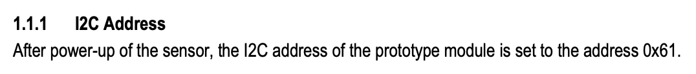

# Room environmental sensor

This project aims to track environmental sensor readings from a room over time. This includes temperature, relative humidity and CO2 levels. Since this will placed indoors it will use WiFi as primary network, and send data over time to a central location.
If I have time I will also add a sound level tracker.

- [Room environmental sensor](#room-environmental-sensor)
    - [Objectives](#objectives)
    - [Material](#material)
    - [Environment setup](#environment-setup)
    - [Putting everything together](#putting-everything-together)
    - [Platforms and infrastructure](#platforms-and-infrastructure)
    - [The code](#the-code)
    - [The physical network layer](#the-physical-network-layer)
    - [Visualisation and user interface](#visualisation-and-user-interface)
    - [Finalizing the design](#finalizing-the-design)
    - [Links and resources](#links-and-resources)

### Objectives

I work in Educational Technology and wanted to dig into IOT and it's applicancy. The impact the working environment has on everyone, including students, is well known. Having IOT units inside the classrooms would allow to track the impact it has, and how the rooms are actually fitted for the numebr of students across all days. This can then be overlayed with other information, like performance, grades, schedules etc. to get an even bigger impact of the data.

Since this all about learning quickly I gave chosen tools that gets me to the end goal quickly, and perhaps not the best choices for a production grade product.

### Material

| Unit | Description | Price|
|------|-------------|------|
| [LoPy4 Bundle](https://www.electrokit.com/produkt/lnu-1dt305-tillampad-iot-lopy4-and-sensors-bundle/) | A bundle created to the previous course by Electrokit, includes the LoPy4 | 949 SEK |
| [SCD-30](https://www.electrokit.com/produkt/miljosensor-scd-30-co2-temperatur-rh/) | Environmental sensor, with "true" CO2 measurements | 799 SEK |
| [Adafruit CCS811](https://www.electrokit.com/produkt/adafruit-ccs811-air-quality-sensor-breakout-voc-and-eco2/) | Environmental sensor for air quality | 279 SEK |
| | **Total price** | 2027 SEK |

I wanted to see the difference between a more expensive environmental sensor and a cheaper one. I have opted for the [SCD-30](https://www.electrokit.com/produkt/miljosensor-scd-30-co2-temperatur-rh/) priced at 799 SEK and the cheaper [Adafruit CCS811](https://www.electrokit.com/produkt/adafruit-ccs811-air-quality-sensor-breakout-voc-and-eco2/) priced at 279 SEK. Both track CO2, but do it very differently.

CCS-811 measures [Volatile Organic Compounds](https://www.epa.gov/indoor-air-quality-iaq/what-are-volatile-organic-compounds-vocs) in the air and tries to deduce the equivelent carbon dioxide (eCO2) based on the total VOC in the air. This is based on the asumption that if the main producer of VOC in a room are people, there is a proportional amount of CO2 [^1]. In other words, it's far from exact, but if used in a room mainly housed of people it will give rough estimate of the CO2.

On the contrary, the SCD-30 uses a [Nondispersive Infrared sensor (NDIR)](https://en.wikipedia.org/wiki/Nondispersive_infrared_sensor) which is a spectroscopic sensor that actually analysis the gas molecules in the air, and outputs the CO2 composition in the air by parts-per-million. This is not an estimate based on other factors, but the real deal. But it is also 2.5 times the price, is it worth it?

Both sensors uses [I2C](https://learn.sparkfun.com/tutorials/i2c/all) to communicate, making it easy to hook both up and read the measurements from both.

### Environment setup

First up is getting the machine working, and to do so I followed the [Getting Started guide from Pycom](https://docs.pycom.io/gettingstarted/). I am running on a Macbook Pro 2019 running macOS 11.4 (Big Sur). I already had NodeJS installed in my machine which is a pre-requistes and decided to use VSCode as it's my preferred choice of IDE. That did however prove to not be completely straight forward. Following the guide I installed the [Pymakr plugin](https://marketplace.visualstudio.com/items?itemName=pycom.Pymakr) and seeing as I already had NodeJS installed I thought I would be golden. But after installing the plugin nothing happens, and all commands fails:
#TODO - Insert image here

After some fiddling around it turns out you need one more thing on Mac, xcode. So I installed XCode on my machine and presto, all working as intended.

I also set up an account with [Pybytes](https://pybytes.pycom.io/) as I will use that as my main platform to configure and collect data from the sensor.

### Putting everything together
I placed the LoPy4 in the Pycom Expansion board that was both part of the Bundle from Elektrokit. Since both sensors are communicating over I2C I can reuse the same connection for both sensors and communicate with both over the same wires.

### Platforms and infrastructure
### The code
To handle the communication with the SCD-30 sensor I found a class online [^2] that I downloaded and placed in the `/lib` directory named `/lib/scd30.py`.

### The physical network layer
### Visualisation and user interface
### Finalizing the design

### Links and resources

[https://www.sciencedirect.com/topics/agricultural-and-biological-sciences/relative-humidity]
[https://cdn.sparkfun.com/assets/d/c/0/7/2/SCD30_Interface_Description.pdf]
[https://learn.adafruit.com/adafruit-scd30?view=all]

[^1]: https://www.careforair.eu/en/eco2/
[^2]: https://github.com/agners/micropython-scd30/blob/master/scd30.py